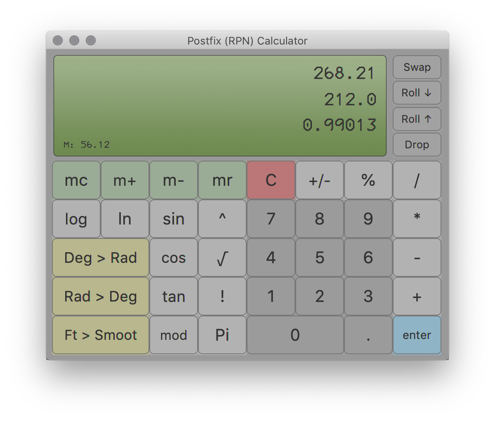

# postfix-jfx

**PURPOSE OF PROJECT**: Postfix evaluation  
**DATE**: 20190403  
**AUTHORS**: Zed Chance  

## PostfixGUI.java
A postfix expression evaluator that takes a string as input

### Supported postfix operations
| Operator | Description                                |
| -------- | ------------------------------------------ |
| `+`      | add                                        |
| `-`      | subtract                                   |
| `*`      | multiply                                   |
| `/`      | divide                                     |
| `^`      | exponent                                   |
| `!`      | factorial                                  |
| `sqrt`   | square root                                |
| `pi`     | push pi onto stack                         |
| `sin`    | sine                                       |
| `cos`    | cosine                                     |
| `tan`    | tangent                                    |
| `ln`     | natural log                                |
| `mod`    | modulo (can also use `%`)                  |
| `dup`    | duplicate                                  |
| `swap`   | swap top 2 items                           |
| `rot`    | rotate items                               |
| `max`    | leaves the higher of 2 values on the stack |
| `min`    | leaves the lower of 2 values on the stack  |
| `dist`   | distance formula (distance to origin)      |

## GUI.java
A postfix (RPN) calculator GUI that shows stack



### To run in IntelliJ 
Edit the run configuration VM options to include: 
```
--module-path /path/to/javafx-sdk-11.0.2/lib --add-modules javafx.fxml,javafx.controls,javafx.media
```
replacing `/path/to` with proper path

### Extra features implemented
- Calculator buttons
- Stack visualization
- Factorial (!)
- Pi
- Trigonometric functions
- Natural log
- Modulo
- Degrees to radians
- Radians to degrees
- Feet to smoots
- Error handling
- Background image
- Sound effects
- Memory


### Keyboard bindings
| Key      | Operation      |
| -------- | -------------- |
| `0-9`    | numbers        |
| `+`      | addition       |
| `-`      | subtraction    |
| `*`      | multiplication |
| `/`      | division       |
| `^`      | exponent       |
| `%`      | modulo         |
| `enter`  | push item      |
| `delete` | drop item      |
| `\ `     | swap           |
| `[`      | roll up        |
| `]`      | roll down      |
| `s`      | toggles sound  |
